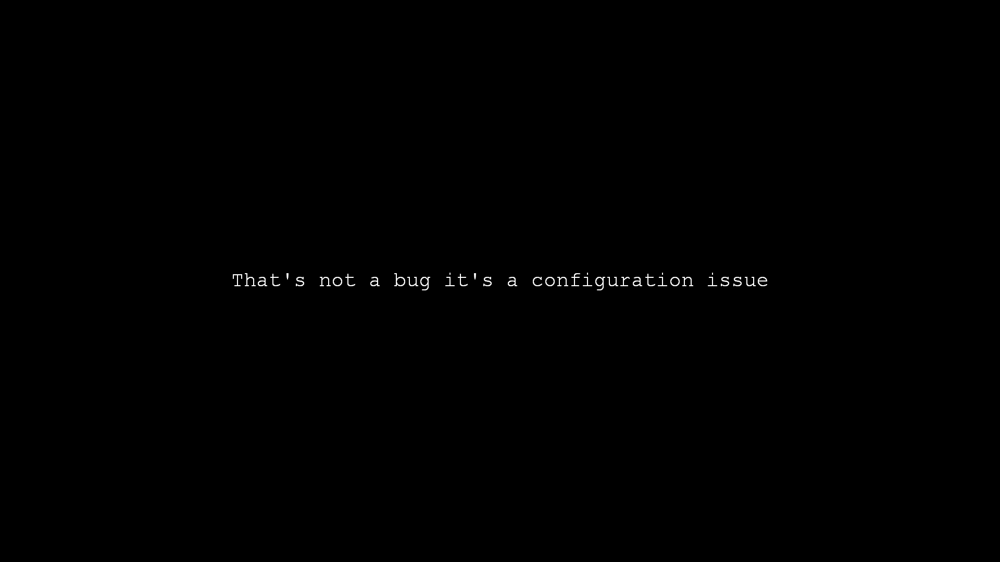

# Developer Excuses Screensaver for Windows
This is a Windows screensaver, which displays excuses for lazy coders from http://developerexcuses.com/

## Installation
1. [Go to the latest release page](https://github.com/AntonShalgachev/developer-excuses-screensaver/releases/latest)
2. Download screensaver executable
      * If your system is x64, then download [`DeveloperExcusesScreensaver_x64.scr`](https://github.com/AntonShalgachev/developer-excuses-screensaver/releases/latest/download/DeveloperExcusesScreensaver_x64.scr)
      * If your system is x86, then download [`DeveloperExcusesScreensaver_x86.scr`](https://github.com/AntonShalgachev/developer-excuses-screensaver/releases/latest/download/DeveloperExcusesScreensaver_x86.scr)
3. Copy downloaded file to `X:/Windows/System32` where X is the drive where your operating system is installed
    * Note that you may skip this step if you don't have access to this folder. In this case you won't see this screensaver in the list of screensavers in "Screen Saver Settings" dialog after installing `.scr` file
4. Right-click the `.scr` file and choose "Install". Dialog will appear with the "Developer Excuses" screensaver selected: 
5. [Optional] You may change the settings of the screensaver by pressing "Settings..." button
6. Press "Ok" button in the opened dialog to save settings

## Settings
You can customize font, as well as quote update period (note that this parameter is in milliseconds):

